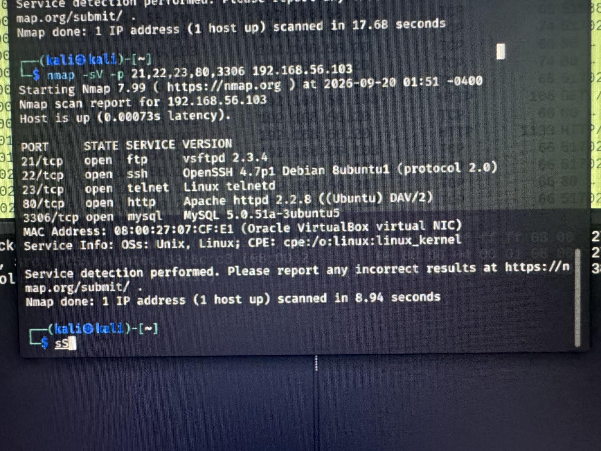
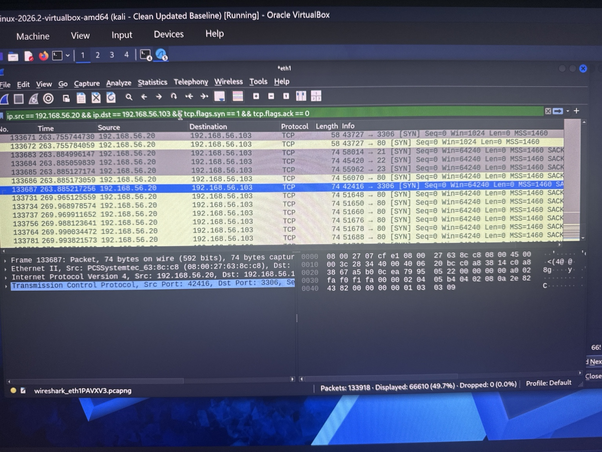
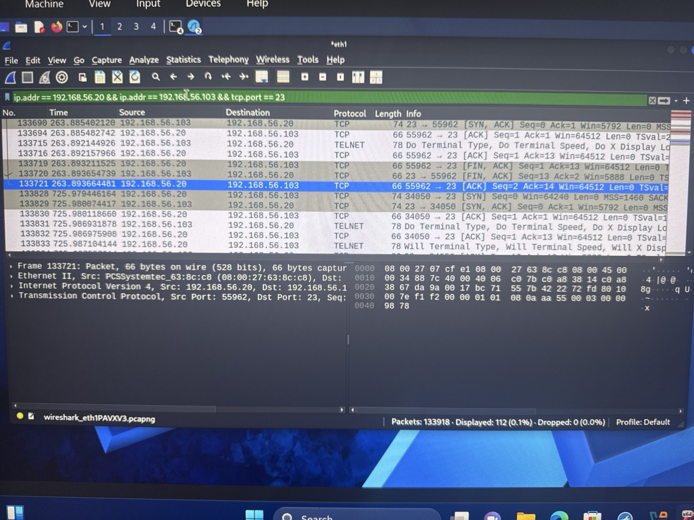

# Network Security Monitoring & Reconnaissance Investigation

## Overview

This project documents a network security monitoring investigation performed in a controlled cybersecurity lab environment.

The objective was to identify and analyze reconnaissance activity against a vulnerable Linux endpoint using packet-level evidence. Network traffic was captured and investigated with Wireshark, while Nmap was used to generate and validate controlled reconnaissance activity.

The investigation focused on identifying suspicious connection patterns, correlating activity across multiple network services, distinguishing automated scanning from application-layer traffic, and determining what could and could not be confirmed from the available evidence.

---

## Lab Environment

| Component | Purpose |
|---|---|
| Kali Linux | Security testing and traffic source |
| Metasploitable 2 | Vulnerable target system |
| Wireshark | Packet capture and network analysis |
| Nmap | Network and service reconnaissance |
| VirtualBox Host-Only Network | Isolated lab network |

### Investigated Hosts

- **Source:** `192.168.56.20`
- **Target:** `192.168.56.103`

All activity documented in this repository was generated and analyzed within an isolated, controlled lab environment.

---

## Investigation Objectives

The investigation was designed to:

- Detect network reconnaissance activity.
- Identify exposed services on the target.
- Analyze communication between source and target.
- Investigate HTTP reconnaissance activity.
- Examine Telnet traffic and protocol negotiation.
- Correlate packet-level observations with Nmap reconnaissance.
- Determine whether the evidence supported successful exploitation or compromise.
- Document findings using a SOC-style investigation methodology.

---

## Initial Reconnaissance

Nmap reconnaissance identified a large exposed attack surface on the target, with approximately **30 open ports** observed during scanning.

Focused service enumeration identified several notable services:

| Port | Service | Observed Version |
|---|---|---|
| 21/TCP | FTP | vsftpd 2.3.4 |
| 22/TCP | SSH | OpenSSH 4.7p1 |
| 23/TCP | Telnet | Linux telnetd |
| 80/TCP | HTTP | Apache 2.2.8 |
| 3306/TCP | MySQL | MySQL 5.0.51a |

These services were selected for additional network investigation because they represented important portions of the target's exposed attack surface.

---

## Finding 1 — High-Volume Network Reconnaissance

Wireshark analysis identified a significant volume of TCP connection attempts from the source system toward the target.

The following display filter was used to isolate initial TCP SYN packets:

`ip.src == 192.168.56.20 && ip.dst == 192.168.56.103 && tcp.flags.syn == 1 && tcp.flags.ack == 0`

The filter returned **66,610 packets**.

The volume and distribution of SYN traffic across numerous destination ports, correlated with the controlled Nmap activity, demonstrated systematic network and service reconnaissance.

### Analyst Assessment

The activity was consistent with automated port and service discovery rather than ordinary application communication.

**MITRE ATT&CK:** T1046 — Network Service Discovery

---

## Finding 2 — Multi-Port Communication

Wireshark TCP conversation analysis demonstrated communication between the source and target across numerous destination ports.

Observed traffic included connections involving FTP, Telnet, HTTP, SMB, MySQL and additional exposed services.

This provided packet-level correlation between the reconnaissance activity and the services exposed by the target.

---

## Finding 3 — HTTP Reconnaissance

HTTP analysis isolated **30 HTTP request packets** originating from the source and directed toward the target.

Observed requests included standard root requests as well as automated probe paths associated with service-detection activity.

This helped distinguish application-layer reconnaissance from the broader TCP scanning activity.

### HTTP Method Investigation

Additional filtering isolated a single HTTP `OPTIONS` request.

The request was used to investigate the capabilities exposed by the target web service. Earlier service analysis identified Apache HTTP Server with WebDAV functionality present.

This activity was treated as HTTP capability enumeration rather than evidence of exploitation.

---

## Finding 4 — Telnet Activity

Traffic analysis identified **112 packets** associated with TCP port 23 between the investigated systems.

Wireshark identified Telnet protocol negotiation within the traffic, confirming connection activity involving the exposed Telnet service.

### TCP Stream Analysis

Selected Telnet TCP streams were reconstructed to determine whether authentication activity or credentials could be observed.

The sampled streams contained minimal application data and did not provide sufficient evidence to confirm:

- successful authentication;
- credential transmission;
- an interactive Telnet session; or
- command execution.

This distinction was important to avoid treating connection activity as proof of compromise.

---

## Investigation Timeline

| Stage | Observation | Assessment |
|---|---|---|
| Host identification | Target responded to network reconnaissance | Active host identified |
| Port scanning | Approximately 30 open ports identified | Broad attack surface discovered |
| Service enumeration | FTP, SSH, Telnet, HTTP, MySQL and other services identified | Service discovery |
| SYN analysis | 66,610 initial SYN packets isolated | High-volume automated reconnaissance |
| HTTP analysis | 30 HTTP requests isolated | Application-layer probing identified |
| HTTP method analysis | OPTIONS request isolated | Web capability enumeration |
| Telnet analysis | 112 TCP/23 packets observed | Telnet connection activity confirmed |
| Stream reconstruction | Limited application data recovered | Successful Telnet authentication not confirmed |

---

## Evidence Assessment

### Confirmed

- Systematic network reconnaissance occurred.
- Multiple exposed services were identified.
- High-volume TCP SYN activity originated from the source.
- HTTP reconnaissance occurred.
- HTTP OPTIONS probing occurred.
- Telnet connection and protocol-negotiation traffic occurred.

### Not Confirmed

The available packet evidence did **not** establish:

- successful exploitation;
- successful Telnet authentication;
- credential compromise;
- persistence;
- lateral movement; or
- post-exploitation activity.

---

## Severity Assessment

**Severity: Medium**

The observed behavior represented active reconnaissance across a broad attack surface and included targeted application-layer probing.

However, the analyzed evidence did not establish successful exploitation or host compromise. The severity would require reassessment if additional evidence demonstrated credential access, exploitation, persistence, lateral movement, or other post-compromise activity.

---

## Recommended Defensive Actions

1. Disable unnecessary and legacy network services, particularly Telnet.
2. Replace plaintext administrative protocols with encrypted alternatives such as SSH.
3. Restrict administrative and database services using firewall rules and network segmentation.
4. Review exposed HTTP/WebDAV functionality and disable unnecessary methods.
5. Monitor for high-volume SYN activity across multiple destination ports.
6. Establish detection rules for rapid multi-port connection attempts from individual sources.
7. Maintain current service versions and patch unsupported software.
8. Correlate network telemetry with endpoint and authentication logs when investigating suspected reconnaissance.

---

## Skills Demonstrated

- Network traffic analysis
- Wireshark filtering
- TCP/IP analysis
- Nmap service enumeration
- Protocol analysis
- Network reconnaissance detection
- Evidence correlation
- SOC investigation methodology
- Incident triage
- MITRE ATT&CK mapping
- Severity assessment
- Technical documentation

---

## Investigation Conclusion

The investigation identified and reconstructed systematic reconnaissance activity from `192.168.56.20` against `192.168.56.103`.

Packet analysis demonstrated high-volume TCP scanning, multi-service discovery, HTTP probing, and Telnet connection activity. Correlation between Nmap results and Wireshark evidence provided multiple independent indicators of reconnaissance.

The investigation did not identify sufficient evidence to conclude that the observed reconnaissance resulted in successful exploitation or compromise.

The case therefore demonstrates the process of progressing from raw network telemetry to a defensible SOC assessment while maintaining a clear distinction between confirmed evidence and analytical inference.
